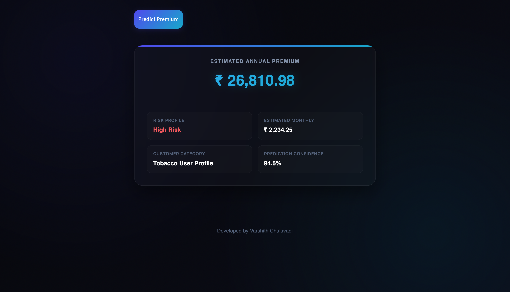

# Insurance Premium Prediction Using Machine Learning

A futuristic AI-powered web application that predicts insurance premium costs using Machine Learning based on customer profile details such as age, BMI, smoking habits, gender, children, and region.

---

# Project Overview

This project uses Machine Learning regression techniques to estimate annual insurance premium charges. The application includes:

- Data preprocessing
- Exploratory Data Analysis (EDA)
- Model training and evaluation
- Interactive prediction system
- Modern futuristic dashboard UI

The project demonstrates the practical implementation of Machine Learning in the insurance and fintech domain.

---

# Features

- Predict insurance premium instantly
- Modern futuristic UI dashboard
- Real-time premium estimation
- Risk profile analysis
- Monthly premium estimation
- Prediction confidence display
- Interactive sliders and dropdowns
- Responsive glassmorphism design

---

# Technologies Used

## Machine Learning
- Python
- Pandas
- NumPy
- Scikit-learn

## Data Visualization
- Matplotlib
- Seaborn

## Frontend/UI
- Antigravity UI
- Modern Glassmorphism Design
- Futuristic Fintech Styling

## Development Tools
- Jupyter Notebook
- VS Code
- Git & GitHub

---

# Dataset Information

Dataset: Medical Cost Personal Dataset

Dataset contains:
- 1338 rows
- 7 columns

Features:
- Age
- Gender
- BMI
- Children
- Smoker Status
- Region
- Insurance Charges

---

# Machine Learning Workflow

1. Data Collection
2. Data Cleaning
3. Exploratory Data Analysis
4. Feature Encoding
5. Train-Test Split
6. Model Training
7. Prediction
8. Model Evaluation
9. Model Saving
10. Frontend Integration

---

# Exploratory Data Analysis

The project includes:
- Distribution Analysis
- Correlation Analysis
- Smoker vs Charges Analysis
- Age vs Charges Analysis
- Data Visualization using Seaborn and Matplotlib

---

# Model Used

- Linear Regression

The model predicts insurance premium charges based on customer details.

---

# Evaluation Metrics

The model was evaluated using:

- Mean Absolute Error (MAE)
- Mean Squared Error (MSE)
- R² Score

The model achieved good prediction accuracy for insurance premium estimation.

---

# Modern AI Dashboard UI

## Homepage


## Prediction Result



---

# Project Structure

```bash
Insurance_Premium_Prediction/
│
├── data/
│   └── insurance.csv
│
├── notebooks/
│   └── Insurance_Premium_Prediction.ipynb
│
├── models/
│   └── model.pkl
│
├── images/
│   ├── homepage.png
│   └── prediction_result.png
│
├── app.py
├── requirements.txt
├── README.md
└── .gitignore